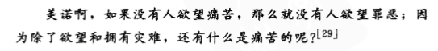

# 什么是逻辑学

逻辑学是区分正确推理与不正确推理的方法和原理的学问，逻辑学研究的宗旨，就是发现并塑述这些规则，使之能够检验论证，区分好坏论证。

论证的题材存在广泛的领域之中，但逻辑学并不关心这些题材，而始终关心它们的形式与品质。

逻辑学家并不关心推理的思想过程，而只关心这种论证的结果，即**论证**。

1. 论证所是从论证所使用的前提或假定推出的吗？
2. 论证的前提能够为接受其结论提供良好的理由吗？

学习逻辑学与良好或正确的推理并不等价

学习逻辑学是为了掌握推理原理，以获得更大的正确推理可能性。

逻辑学并不是万能的，，有些问题并不能用论证（即使是良好的论证）来解决。

# 命题与语句

任何论证都是由命题构成的（基本元素），命题是一种**可以被肯定或否定的东西**。

命题不同于问题、命令、感叹。

任一命题**必是**或真或假的，尽管我们可能并不知道某一特定命题的真假。

命题可以对应多个断定命题的语句。

> Leslie won the election.
> The election was won by Leslie.

命题这个术语所指谓的就是人们通常使用陈述句所断定的东西。

命题并不属于任何特定的语言。

不同的语境中，同一个语句也可能被用来做非常不同的陈述。

> 重庆是直辖市。

命题也有可能是复合的————在一个命题中包含着别的命题。

> “英军已兵临汉堡和不来梅城下。”是“英军已兵临汉堡城下”与“英军已兵临不来梅城下”这两个命题的**联言式**。（联言命题）

>“巡回法庭或者是有用的，或者是无用的。”（选言命题）

>“如果上帝不存在，则有必要捏造一个上帝。”（假言命题、条件命题）

# 论证、前提与结论

推论是以一个或更多命题作为出发点，得出另一个命题的过程。

论证是指任一这样的命题组：一个命题从其他命题推出，后者给前者之真提供支持或根据。

任一一个可能的推论，都有一个相应的论证。

论证不只是一组命题的汇集，它必须包含一种结构，对这种结构的描述通常要使用“前提”和结论两个术语。

一个论证的结论，就是以论证中的其他命题为根据所得出的那个命题，而这些其他的命题，则是论证的前提。

最简单的论证是由一个前提和一个从该前提推出或被它蕴含的结论构成的论证。

>在地球上最先出现生命时没有人存在。因此任何关于生命起源的陈述都应视为理论而非事实的陈述。

不管简单或复杂，任何论证都是由一组命题构成，其中一个命题是结论，其他命题是用以支持结论的前提。

有些复合命题与论证非常相似，需要细心辨识避免混同。

>如果火星在其具有与地球相似的大气层和相似气候的早期曾有生命演化，那么目前科学家确信在我们的星系中存在无数颗其他星球上也会有生命演化

在这个假言命题中，两个支命题都没有被肯定，其中没有推论得以构成，没有结论被认证为真，故不是论证。

>看来，目前科学家确信在我们的星系中存在着无数颗其他星球上会有生命演化，因为火星在其具有与地球相似的大气层和相似气候的早期非常有可能曾有生命演化。

此处是个论证。

# 论证的分析

通常有两种分析技法用于论证分析：一种是解析(paraphrase)，即用清楚的语言和逻辑顺序表明论证中的命题；另一种是图示(diagram),用二维空间关系图展示论证的结构。
## 解析法

## 图示法

## 多重复合论证

当一段话包含多个论证和若干相互关联并不明显的命题时，图示法特别有用。

一个孤立表达的命题即非前提也非结论。在一个论证中，作为假定出现的命题就是前提，被推定为从假定命题推出的命题就是结论。前提和结论是相对的(relative)术语。

# 论证的辨识

## 结论和前提提示词

## 语境中的论证

不作为前提和结论的附加材料，用于提供背景信息。

## 非陈述形式的前提

反问句用作论证前提是非常普遍的，也很有修辞效果，但这样的使用是有风险的。

作为前提的问句不真也不假，那么这个论证是有缺陷的，而其缺陷正可能被问句掩盖。

不过，把真正的反问句作为前提使用是一种很机敏的方法。通过暗示被期望的答案并且引导读者自己引出那个答案，可以增强论证的说服力。

## 未明确陈述的命题

>他不愿接受王冠，所以他的确没有一点野心。

>这项研究（包括对胚胎干细胞的适用）是非法的，这是因为：故意杀死人类胚胎是这项研究的基本组成部分。

# 论证和说明

任何一个特定的语段究竟是论证还是说明，取决于那个语段所服务的目的。如果我们的目的是要确立某个命题Q的真，为此我们提出某个证据P来支持Q，我们可以说“Q因为P”我们便以P为前提为Q建立了一个论证。但假设Q是已知为真的，这种情况下我们可以希望对它为什么是真的给出一个说明，我们也可以说“Q因为P”。

总会有一些语段，其目的难以确定，可能需要给予两种同样有道理的解读，产生不同的结果。

# 演绎和有效性

